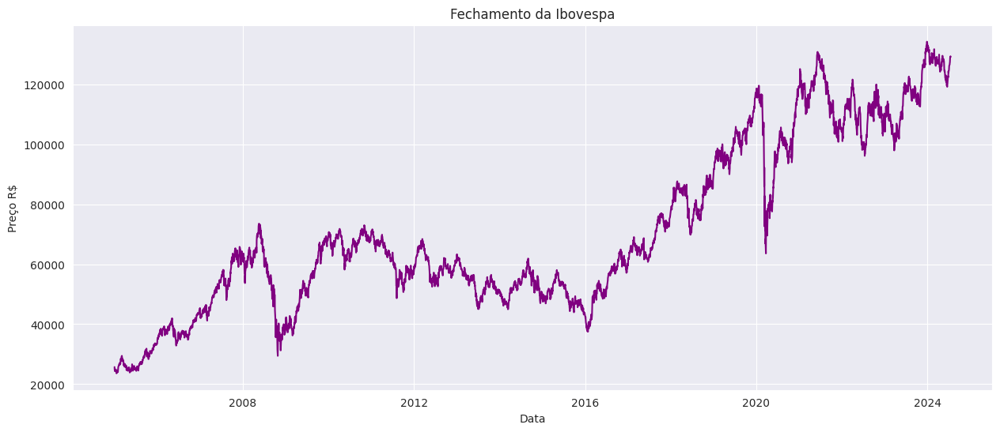
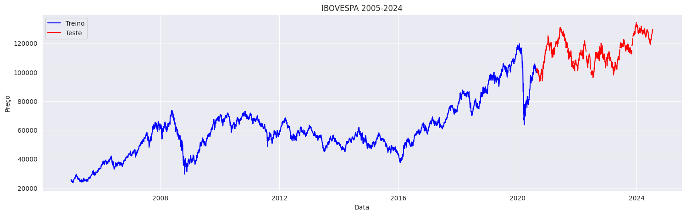
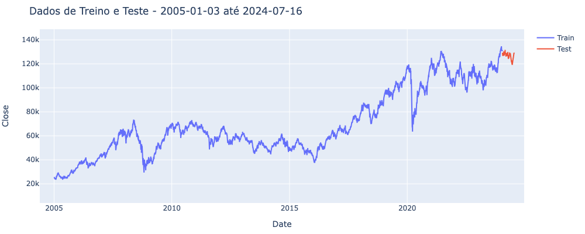
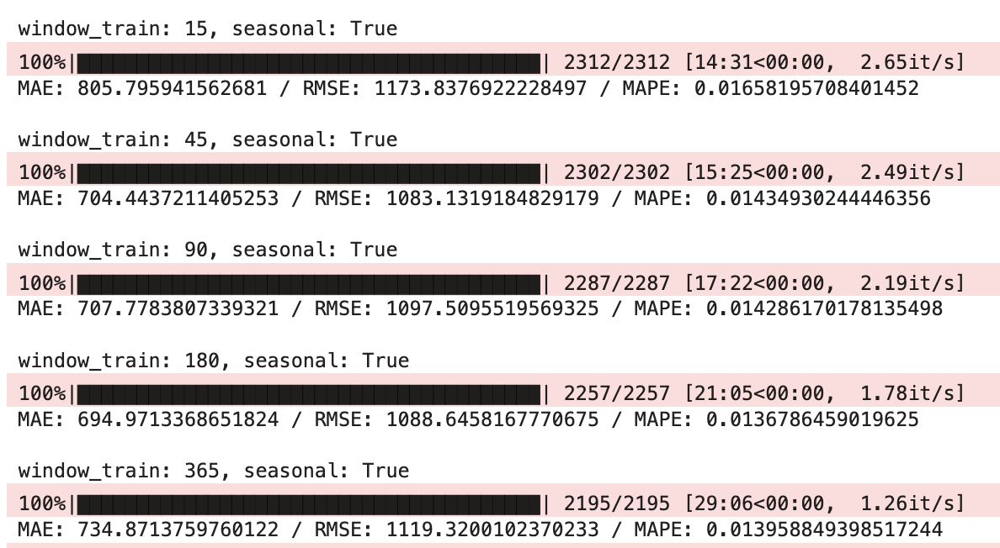
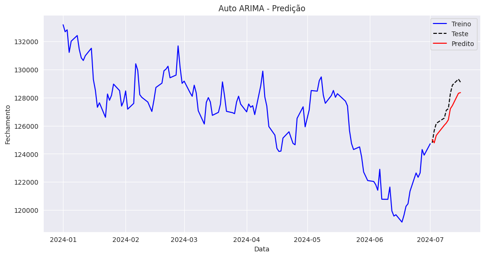
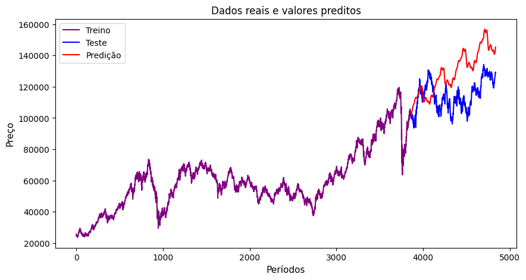
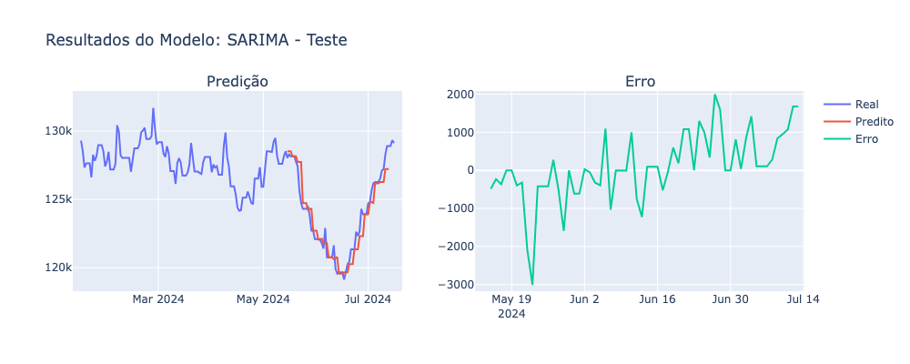
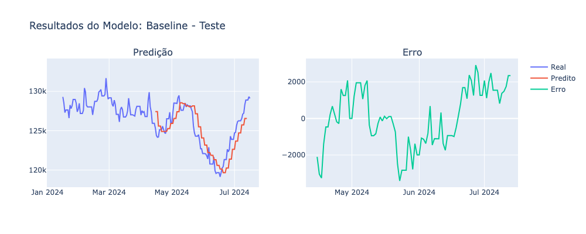
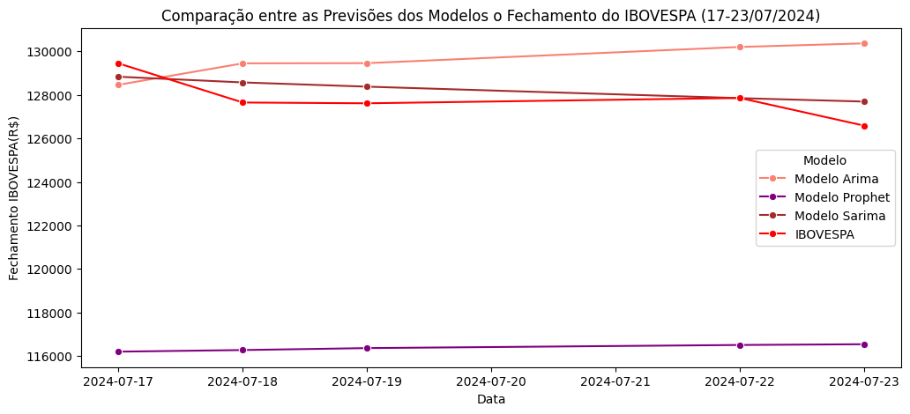

# **Projeto - Previsão IBOVESPA**
---

**Grupo 40** - Autores: 
André Lima Inácio - RM:354038 
Bruna Afonso dos Santos - RM:353283 
Charles Ringenberg - RM:353613 
Jheniffer Dias Pereira - RM:354034 
Pâmela Cristine Amorim Joanas - RM:353440 

**Proposta do Projeto**
---
Realizar um modelo preditivo com dados da IBOVESPA(Bolsa de valores) para criar uma série temporal e prever diariamente o fechamento da base.

**Contexto**
---

Neste projeto, analisamos e previmos o fechamento do IBOVESPA, o principal índice de desempenho das ações negociadas na B3, a bolsa de valores oficial do Brasil, utilizando dados de 2005 a 2024.

Dividimos os dados em período anual para compreender o cenário total da base, posteriormente, em intervalos diários, para identificar padrões e tendências de mercado. Aplicamos modelos de previsão para intervalos de 3 e 5 dias, com o objetivo de melhorar a precisão e entender as variações de curto prazo. Esta abordagem detalhada visa aprimorar a tomada de decisão em investimentos financeiros.

**Arquivos .ipynb**
---
Todo o desenvolvimento e resultados obtidos estão disponíveis em: [Resultados](https://github.com/Grupo-40/tech-challenge-2/tree/main/eda)

**Modelos Testados**
---

* Arima
* Prophet
* Sarima
* Naive
  
**Metodologias e Resultados**
---

Para a análise, foram coletados dados de preços, incluindo máximos, mínimos, aberturas e fechamentos, conforme ilustrado no gráfico abaixo. Destaca-se que a base histórica apresenta oscilações ao longo do período, com quedas significativas no fechamento do IBOVESPA em 2009, 2016 e 2020. Essas quedas estão relacionadas à crise imobiliária global iniciada nos Estados Unidos, à crise política no Brasil e à pandemia de COVID-19, respectivamente.

* **Modelos Arima e Prophet**

Após os tratamentos pertinentes na base foi realizada a divisão dos dados entre treino e teste. Sendo utilizado 80% para treino e 20% para teste. 

* **Modelos Sarima e Naive**

Dividimos os dados históricos em dois períodos: os 6 meses mais recentes foram utilizados para testar os modelos, enquanto os dados anteriores foram destinados ao treinamento.

Para garantir uma avaliação precisa e robusta dos modelos, aplicamos o método de Cross Validation específico para séries temporais.

Durante os testes, experimentamos diversas durações de "janelas" de treinamento para a previsão. No caso do modelo SARIMA, constatamos que uma janela de 180 dias produziu os melhores resultados na validação cruzada.

Com base nesses resultados, definimos que o modelo seria treinado utilizando os dados dos últimos 180 dias para prever os próximos 3 dias.

* **Realizando as previsões com o Modelo Arima**
  
Aplicou-se o modelo ARIMA com os termos “p”, “d” e “q” com os valores 1, 1 e 1 respectivamente. Assim obteve-se um RMSE (Root Mean Squared Error) de 11%. A determinação dos valores dos termos pode não ser exata, dado que depende da análise do observador, assim, podendo ser incorreta. Entendendo esta dificuldade, utilizou-se a função **pmd.arima.auto_arima**. Está foi projetada para selecionar o modelo ARIMA ideal. 

Para realizar predição, considerou-se 15 dias para teste e 5 para previsão futura, para isso utilizou-se a base histórica (base de treino (03-01-2005 - 01/07/2024)). Obtendo-se um RMSE (Root Mean Squared Error) de 1,3%. 

O modelo Arima apresentou bons resultados quando utilizado para prever poucos dias.

* **Realizando as previsões com o Modelo Prophet**

Inicialmente, com o objetivo de entender o comportamento do modelo utilizou-se 80% treino e 20% teste. Este apresentou um RMSE de 16%. 

Posteriormente, utilizou-se os mesmos dados, mas com ajuste na proporção entre treino e teste para 95% e 5%, respectivamente. Sendo 5% dos dados para teste e previsão futura de 5 dias. Essa abordagem resultou em um RMSE de 6%.

O modelo Prophet apresentou resultados medianos, sendo mais eficaz em previsões de curto prazo. Em mercados financeiros altamente voláteis, esses pressupostos podem não capturar todas as nuances dos dados. Dado que o mercado de ações é altamente volátil e influenciado por fatores imprevisíveis, como notícias, eventos políticos e mudanças econômicas, dificulta a previsão precisa. Além disso, muitas ações seguem padrões complexos que os modelos lineares não conseguem capturar adequadamente, evidenciando a necessidade de abordagens mais sofisticadas para previsões de longo prazo.

* **Realizando as previsões com o Modelo Sarima**
  
O modelo SARIMA, por sua vez, obteve um MAPE de 0,50% para o mesmo período de previsão, destacando-se como o modelo mais preciso.

* **Realizando as previsões com o Modelo Naive**
  
O modelo Baseline (Naive) apresentou um MAPE de 1,06% no conjunto de teste para a previsão de 3 dias. Esse resultado foi utilizado como benchmark para os demais modelos.

* **Resultados da Previsão Futura Arima, Prophet e Sarima**

Abaixo estão os resultados dos modelos utilizados para prever o fechamento da bolsa nos 5 dias seguintes ao último dado da base, que abrangem o período de 17/07 a 23/07. O modelo SARIMA apresentou previsões mais próximas dos fechamentos reais do IBOVESPA. Em comparação com o modelo Prophet, muitas atividades seguem padrões complexos que os modelos lineares não conseguem captar corretamente; e o modelo Auto ARIMA se mostrou mais efetivo em capturar os movimentos de oscilação dos dados no futuro, porém para prever poucos dias, dado as suas particularidades, ambos não atingiram um nível de assertividade como o do SARIMA.

|               | Modelo Arima      | Modelo Prophet    | Modelo Sarima     |
|---------------|-------------------|-------------------|-------------------|                
| 2024-07-17    | 128466.96         | 116201.06         | 128836.87         |
| 2024-07-18    | 129451.42         | 116275.63         | 128575.27         |
| 2024-07-19    | 129460.74         | 116364.82         | 128380.67         |
| 2024-07-22    | 130204.63         | 116508.02         | 127853.33         |
| 2024-07-23    | 130370.51         | 116542.33         | 127695.29         |

**Conclusões**
---
Com base nas análises realizadas com os modelos testados, juntamente com as métricas e validações usadas, que foram erro Percentual Absoluto Médio (MAPE) como métrica para avaliar a precisão dos modelos; e para a validação, empregamos a técnica de Janelas Deslizantes (Sliding Window), que nos permite testar o modelo em diferentes intervalos temporais, garantindo a robustez dos resultados, respectivamente. É válido ressaltar que todos os modelos atingiram uma taxa de acuracidade maior 70%, porém existe um modelo mais assertivo, mediante aos resultados apresentados e análises, que é o modelo SARIMA. O modelo foi treinado com dados dos últimos 180 dias, foi escolhido como o mais adequado para as previsões. Ele demonstrou um excelente desempenho tanto na fase de validação quanto na fase de teste. 

**Referências Bibliográficas**
---
SILVEIRA, P. H. M. (2019). O que move o preço da ação? Um estudo sobre as maiores variações diárias do Ibovespa na década de 2010. 
IBOVESPA(IBOV).Inventing.com, 2024. Disponível: < https://br.investing.com/indices/bovespa-historical-data >. Acesso em: 16 de jul. de 2024.

